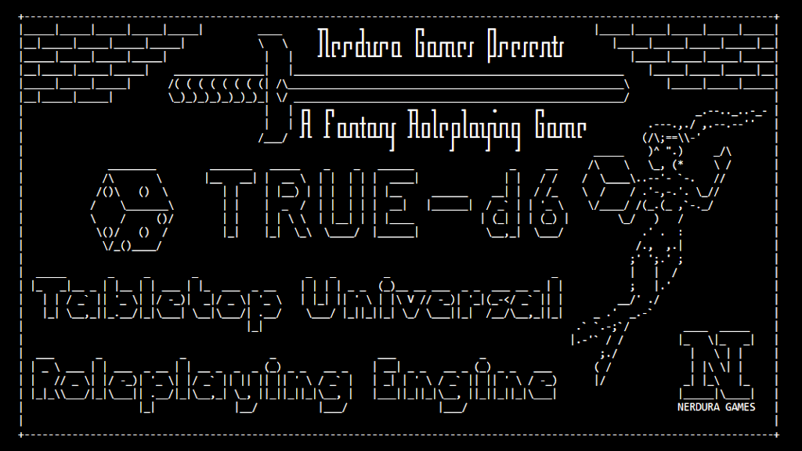
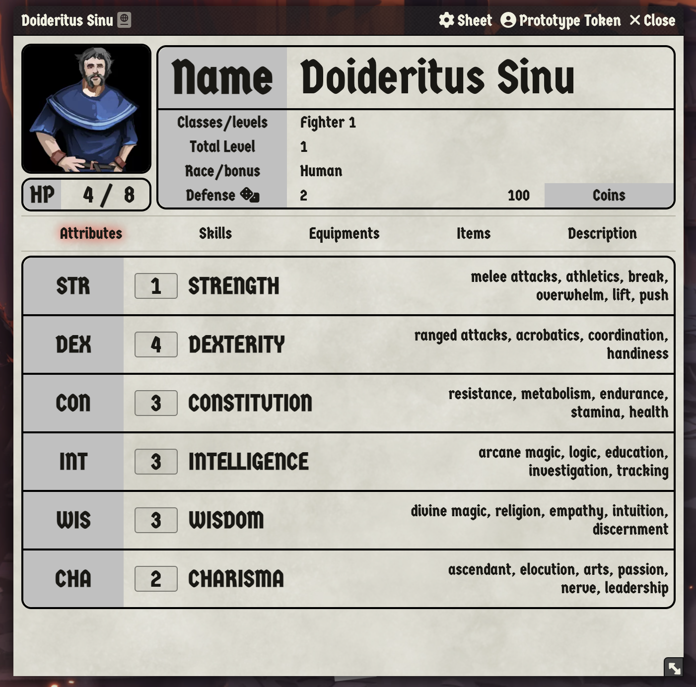
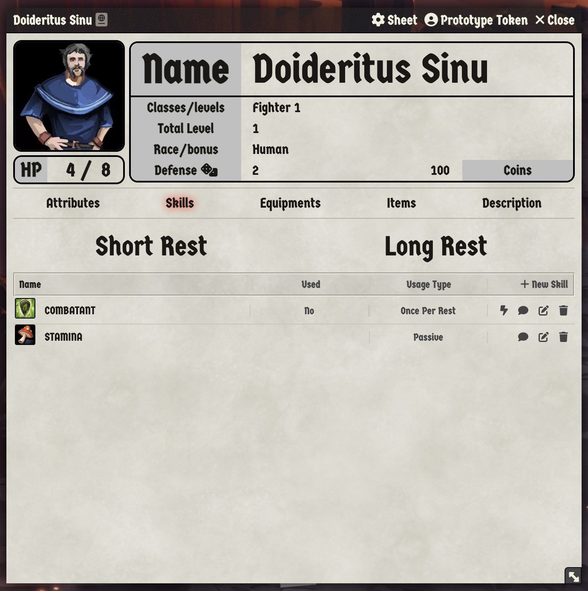
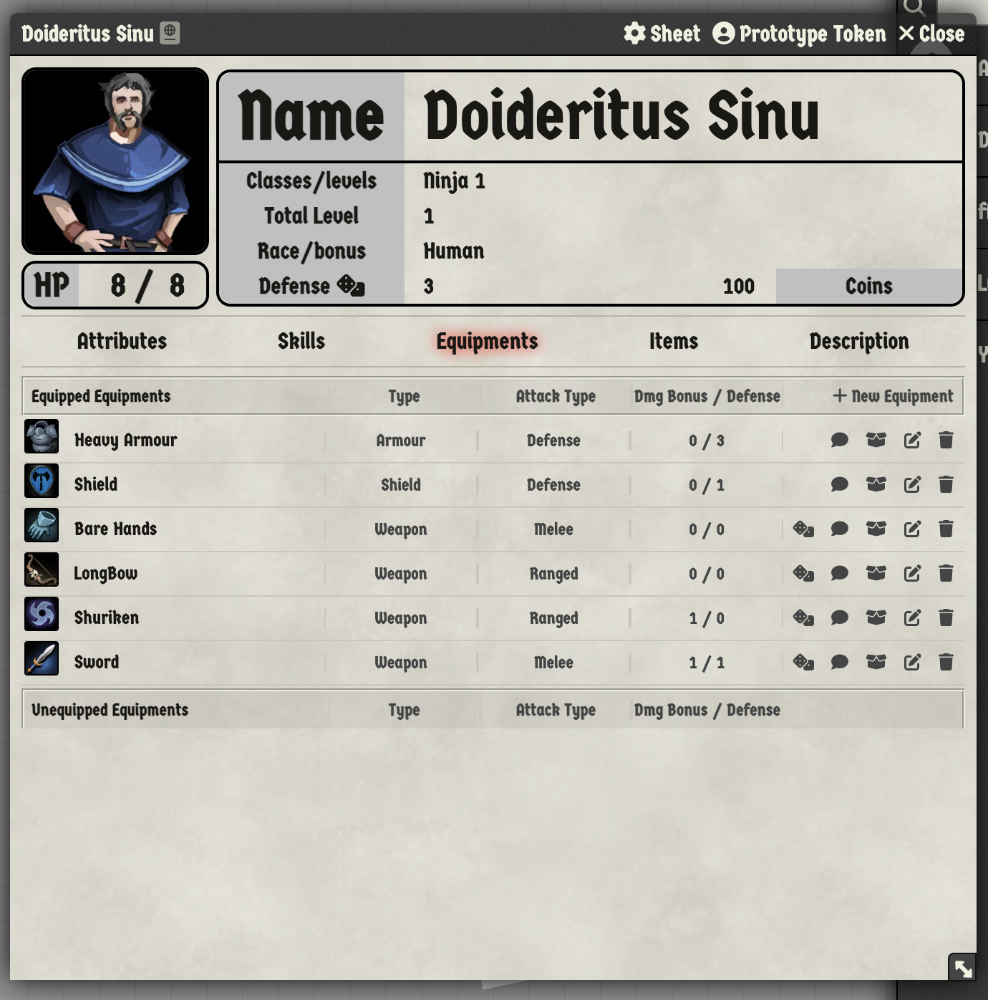
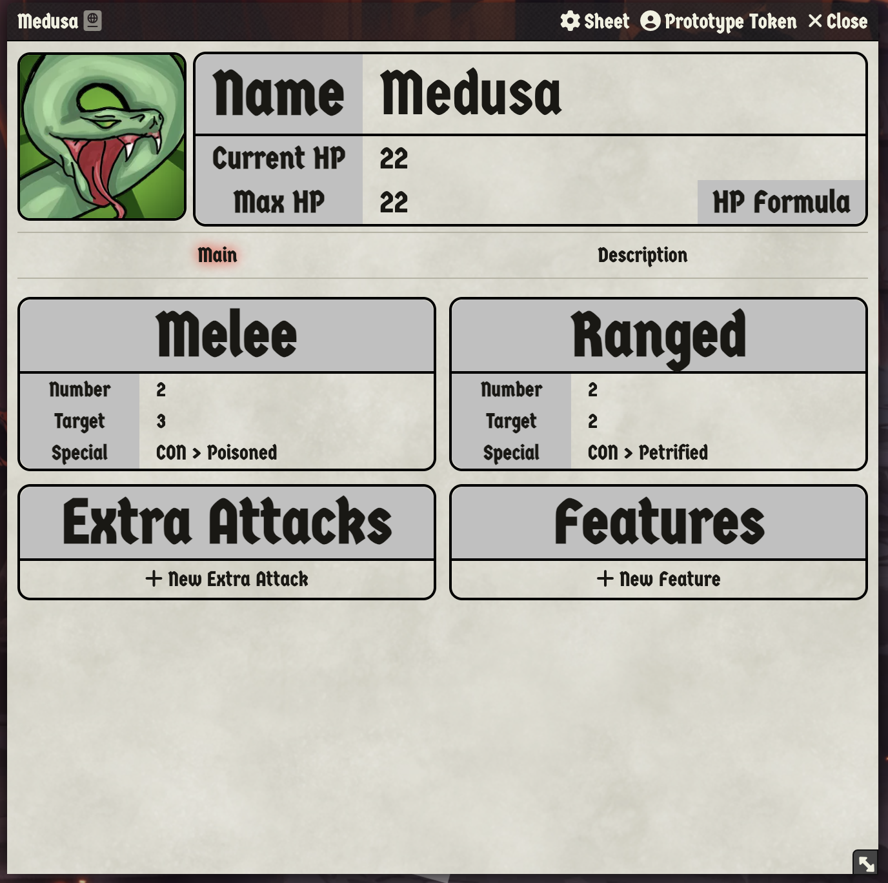

# TRUE-d6

 

An **OFFICIAL** Foundry implementation for the TRUE-d6 System!

> [!WARNING]
> ## 🚧 System Under Development
> 
> **Important Notice:** This system is currently in active development. Consider the current releases as "beta", which implies that breaking changes may occur. While I strive to minimize disruptions, they are sometimes unavoidable. For instance, recent issues, both open and resolved, have prompted significant structural adjustments planned for Version 0.0.5.
> 
> Please use the system with this in mind, understanding that changes are ongoing, particularly as I develop the Kogarashi premium module, the system's first real-world application. Your patience and feedback are greatly appreciated as we work towards refining and stabilizing the system.

Tabletop Roleplaying Universal Engine d6, or TRUE-d6, is a flexible and minimal TTRPG. Its core system is designed for fantasy settings, but it can be adapted to anything.

TRUE-d6: created by Lucio Gozzi / Nerdura Games

Implemented by: [CussaMitre](https://github.com/Cussa)

To acquire TRUE-d6: [https://preview.drivethrurpg.com/en/product/454719/TRUEd6](https://preview.drivethrurpg.com/en/product/454719/TRUEd6)

## Key Operations!

- Rollable items: anything with the "blue" color when the mouse is over
- Roll with advantage: hold `SHIFT` (the item will become green) and click on it
- Roll with disadvantage: hold `ALT/OPTION` (the item will become red) and click on it
- Exhaust a rollable skill: right click on the dice

## Examples

  
  
  
  
  

## Changelog

### 0.0.5 (In development)
- 🧹 remove "spell" item
- 🚸 Show which kind of item player is changing
- 🐛 only tries to open first actor if there is an actor
- ✨ Allow Skill and Equipment to define RollStyle
- ✨ use colors to define adv/disadv in rollables
- 🐛 Handle situation where "double adv/disadv"
- ✨ Custom Active Effects system 😃
- 🔨 show Critical success even if not an attack
- 🐛 Send attribute key to roll
- ✨ Use right click to exhaust a rollable skill
- 🐛 Roll a 1 is not a critical success
- ✨ Allow skill to have a custom formula
- ✨ Allow monsters to have skills (Fix #1)
- ✨ PerDay ActiveEffect handler
- ✨ Limit the min/max numbers for attributes
- 🌐 Change skill "Used" to "Exhausted"
- ✨ Mark skill as rollable if it has a formula too
- ✨ Move NPC skills to main page
- 🧹 Remove "extra-attack" item (handled by "Skills" now)
- 🧹 Remove "features" item (handled by "Skills" now)
- 🔥 Remove spell sheet template
- ✨ Change item to `Inventory Item`
- ✨ Add price to Equipment
- ✨ Enrich item description
- ✨ Remove starting equipment from Inventory Item
- ✨ Insert send to chat for Inventory items
- 🐛 Adjust the equipment chat description
- ✨ Starting equipment configuration
- ✨ Add default items into player inventory
- 🐛 Fix the `perDay` regex (using `(SPECIAL)`)
- ✨ Status Effects with the names used in TRUE-d6

### 0.0.4
- 🐛 Disable debug when publishing the release

  

    <h3>
      Older versions
    </h3>
  

### 0.0.3
- 🐛 Only use item if there is an item
- 📝 udpate README with examples

### 0.0.2
- 💚 send assets into the zip folder

### 0.0.1
- 🎉 Project initialized

