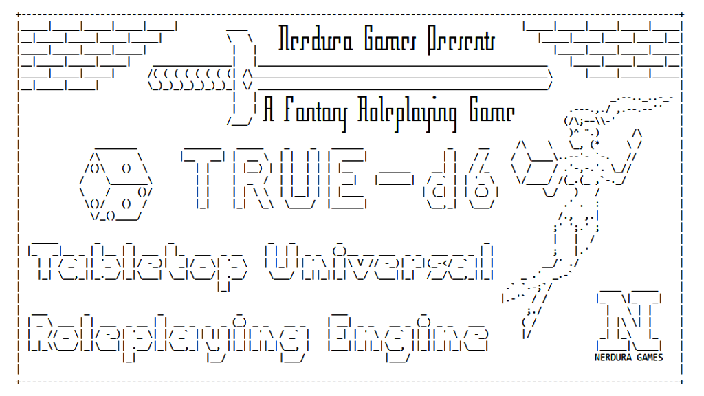

# TRUE-d6

 

An **OFFICIAL** Foundry implementation for the TRUE-d6 System!

Tabletop Roleplaying Universal Engine d6, or TRUE-d6, is a flexible and minimal TTRPG. Its core system is designed for fantasy settings, but it can be adapted to anything.

TRUE-d6: created by Lucio Gozzi / Nerdura Games

Implemented by: [CussaMitre](https://github.com/Cussa)

To acquire TRUE-d6: [https://preview.drivethrurpg.com/en/product/454719/TRUEd6](https://preview.drivethrurpg.com/en/product/454719/TRUEd6)

## Examples

